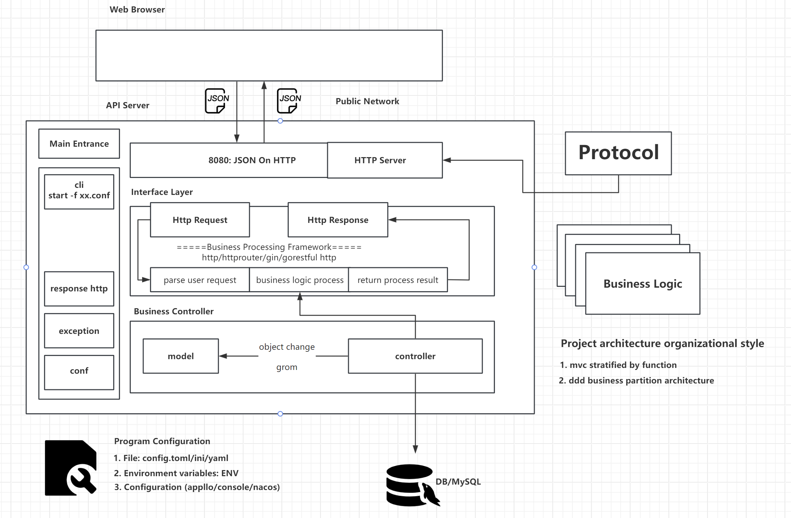
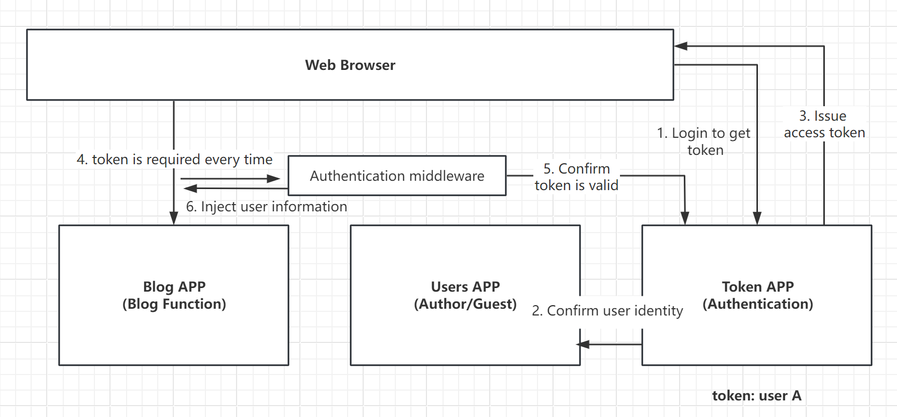
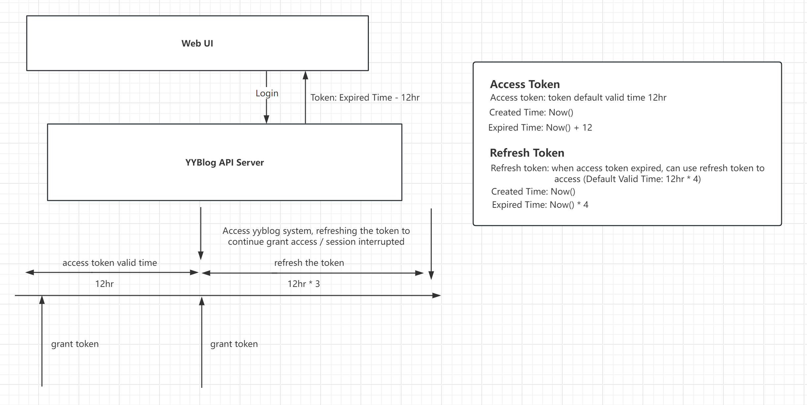
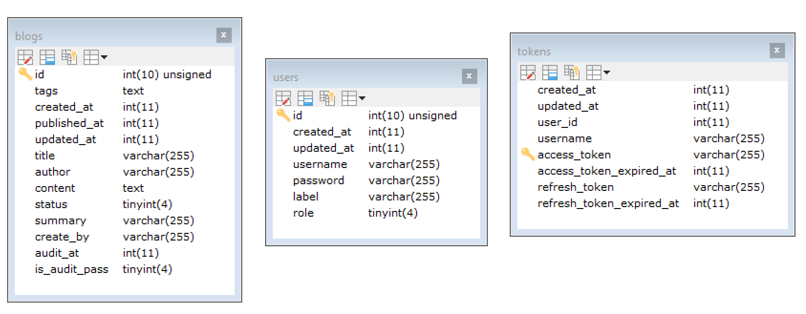
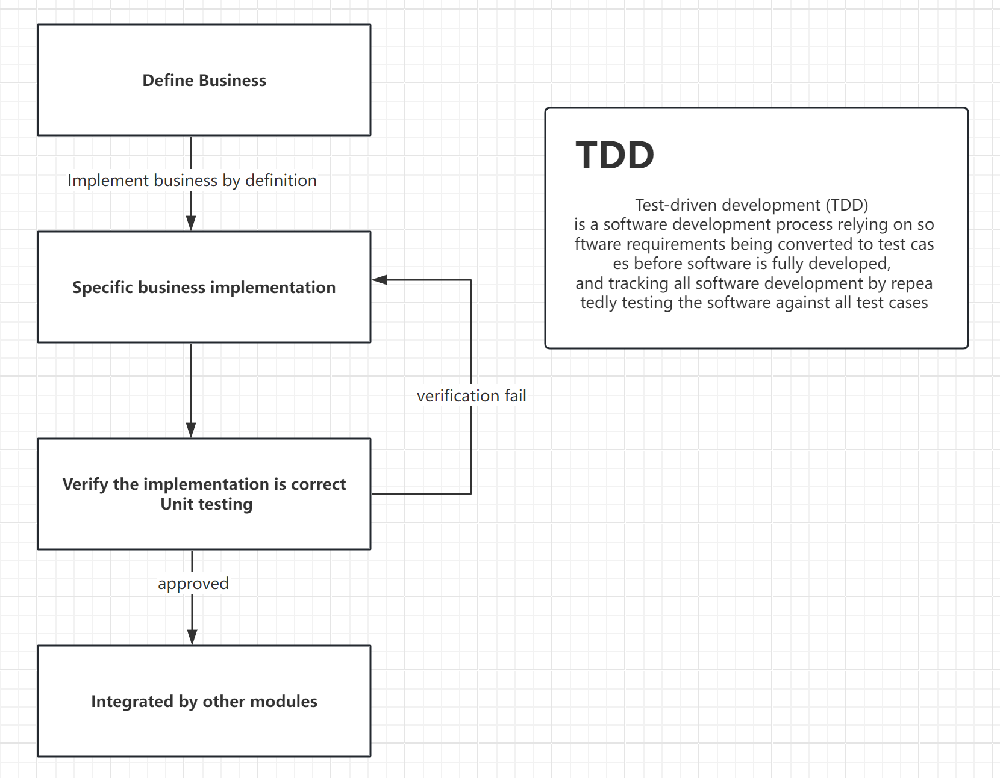

## YYBLOG - Go


### Requirements

Create a new blog system use for yybloger.com,  
refer old python yyblog django project and wordpress system structure  
to create a self new logic blog to learn the basic go language startup for my first go projects.

Make some different for old python yyblog system,  
using MVC structure of front (Vue3 + ArcoDesign) and back ends (Restful API SDK) separation


### Software

- CentOs 7
- Go 1.20.5
- MySQL


### Architecture Design




### Business Architecture


### Project Design

#### Interaction process



#### Application
- Blog APP (Blog Function)
- Users APP (Manage Users Author/Guest)
- Token APP (Authentication)

#### Token Expired



### Databases Design


Note:
is now popular to avoid use foreign key,  
just let the program decide how to handle the relationship based on its business logic.

### Restful API Design
Restful: (Resource) Representational State Transfer  
- Resource Representational: Resource definition (server object or a row of records in the database)
- State Transfer:  create/modify/delete

```
1. Resource definition
1.1 A type of resource
/yyblogs/api/v1/blogs: blogs type of resource: blogs
/yyblogs/api/v1/users: users type of resource: users
1.2 A Resource
/yyblogs/api/v1/users/1: 1 resource id : 1

2. state transition: The only state transition is defined through HTTP Method, which is understood as the user's action against a certain type or resource.
POST: Create a type of resource, POST /yyblogs/api/v1/users Create a user, specific parameters are stored in the body
PATCH: Partial modification, PATCH /yyblogs/api/v1/users/1, Make some modifications to the attributes of the user with id 1, name:abc ("usera" ---> "abc")
PUT: Full modification (overwrite), PUT /yyblogs/api/v1/users/1, Modify all attributes of the user with ID 1. Name:abc clears all attributes except name.
DELETE: Resource delete
GET: Get a type of resource: GET /yyblogs/api/v1/users, Get a resource GET /yyblogs/api/v1/users/1
```

Other Style API:
```
POST URL use named to represent resource operations:  POST /yyblogs/api/v1/users/(list/get/delete/update/...)
POST /pods/poda/logs/watch
```

#### Blog APP Manage (Design of Restful API)
1. Create blog: POST /yyblogs/api/v1/blogs
```json
{
 "title": "",
 "author": "", 
 "content": "",
 "summary": ""
}
```

2. Edit blog(part): PATCH /yyblogs/api/v1/blogs/:id
```json
{
 "title": "",
 "author": "", 
 "content": "",
 "summary": ""
}
```

3. Edit blog(full): PUT /yyblogs/api/v1/blogs/:id
```json
{
 "title": "",
 "author": "", 
 "content": "",
 "summary": ""
}
```

4. Delete blog: DELETE /yyblogs/api/v1/blogs/:id
```
body no send data (just empty)
```

5. GET /yyblogs/api/v1/blogs/:id
```
body no send data (just empty)
```

#### Token APP Manage
1. POST /yyblogs/api/v1/tokens
```json
{
  "username": "",
  "password": "",
  "remember": true
}
```

2. DELETE /yyblogs/api/v1/tokens
```
body no send data (just empty)
```

#### Users APP Manage
```
Completed functions, no API, can directly operate the database, and can also pass unit testing
```

### Project Development
Code writing process

framework (up-->down)  
business logic code(down-->up)

Top-level design: start design from the top to bottom
project business logic code: Write from bottom to top, the core should be the realization of the business

### Project Structure
```
go mod init "github.com/yenyoong99/goProjects/yyblog"
```

- main.go: Main entry file
- conf: program configuration process
- exception: custom exception process
- response: unified data format for request return: {"code": 0, "msg": ""}
- protocol: protocol server
- apps: project module development area

### Project business module development
follows the following rules (Interface):  
sort out requirements, abstract business logic, and define business data structure and interface constraints  

Business implementation (Controller):  
Based on the business definition, select specific skill (such as MySQL/MongoDB/ES) to implement specific business implementations  

Business interface (API):   
If you need to provide API to the outside world, expose the required API interface to the outside world as needed.

Directory structure:  
Define project business: top-level directory of business module, specifically: user/interface.go (interface definition)

Business implementation:   
impl directory in the business module, specifically: user/impl/impl.go (business implementation object)

Business interface:   
api directory in the business module, specifically: user/api/api.go (HTTP Restful interface implementation object)

The difference between API and Interface

- API: Application programming interface, HTTP interface, callable through the network
- Interface: Constraints on an object (Struct)

### User management module development
1. define business
```
// 面向对象
// user.Service, 设计你这个模块提供的接口
// 接口定义, 一定要考虑兼容性, 接口的参数不能变
type Service interface {
	// 用户创建
	// CreateUser(username, password, role string, lable map[string]string)
	// 设计CreateUserRequest, 可以扩展对象, 而不影响接口的定义
	// 1. 这个接口支持取消吗? 要支持取消应该怎么办?
	// 2. 这个接口支持Trace, TraceId怎么传递？
	// 中间件参数，取消/Trace/... 怎么产生怎么传递
	CreateUser(context.Context, *CreateUserRequest) (*User, error)
	// 查询用户列表, 对象列表 [{}]
	QueryUser(context.Context, *QueryUserRequest) (*UserSet, error)
	// 查询用户详情, 通过Id查询,
	DescribeUser(context.Context, *DescribeUserRequest) (*User, error)

	// 作业:
	// 用户修改
	// 用户删除
}
```

2. Business realization  
The business definition layer (abstraction of the business) uses the impl module to complete specific function implementations.
```
// 实现 user.Service
// 怎么判断这个服务有没有实现这个接口喃？
// &UserServiceImpl{} 是会分配内存, 怎么才能不分配内存
// nil 如何生命 *UserServiceImpl 的 nil
// (*UserServiceImpl)(nil) ---> int8 1  int32(1)  (int32)(1)
// nil 就是一个*UserServiceImpl的空指针
var _ user.Service = (*UserServiceImpl)(nil)

// 用户创建
func (i *UserServiceImpl) CreateUser(
	ctx context.Context,
	in *user.CreateUserRequest) (
	*user.User, error) {
	return nil, nil
}

// 查询用户列表, 对象列表 [{}]
func (i *UserServiceImpl) QueryUser(
	ctx context.Context,
	in *user.QueryUserRequest) (
	*user.UserSet, error) {
	return nil, nil
}

// 查询用户详情, 通过Id查询,
func (i *UserServiceImpl) DescribeUser(
	ctx context.Context,
	in *user.DescribeUserRequest) (
	*user.User, error) {
	return nil, nil
}
```

The idea of TDD: ensuring the quality of code

